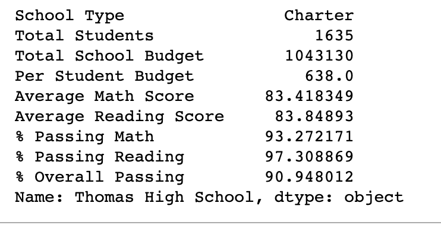

# School District Analysis 
---
Analysis using Anaconda and Jupyter 

## Overview of Project
In this project, we used Anaconda and Jupyter to analyze a school district's data. This school district believed there was academic dishonesty among the ninth graders in one of their schools, Thomas High School. So, we edited the data imported from their CSV files to remove the ninth grade scores from Thomas High School and rerun the analysis, finding how Thomas High School’s scores were affecting the district’s overall test scores. 
## Results
Our results will display the affect of our analysis on the district summary, the school summary and Thomas High School's performance relative to the other school. Further, we will examine how replacing the ninth grade scores affects math and reading scores by grade, scores by school spending, scores by school size and scores by school type.

* In our district summary, we can see that the overall passing percentage dropped from 65.2% to 64.9%. This can be explained by the removal of Thomas High School’s scores, which had a higher than average overall passing percentage. Interestingly, the average math score and average reading score remained the same, while the % passing math and % passing reading increased slightly. These changes can been seen below. 

* In the school summary, we see a drastic change in Thomas High School’s scores after refactoring our code. Their overall passing % drops from 90.1% to 65.1%. Below, we used the loc() method to print results for only Thomas High School displaying the aforementioned change. 

* Before refactoring our data, Thomas High School was among the top schools is overall passing $. Now, we see that they have fallen to the median passing % for the school district. Before the refactoring they had the second highest overall passing % in the district. After refactoring, they are seventh.

* After replacing the scores of the ninth graders at Thomas High School with NaNs, we see that there are no longer math a reading scores displayed for ninth graders at Thomas High School. The other grades at Thomas High School and the other schools are unaffected.

* We see in our scores by school spending that Thomas High School’s overall passing % drops 0.3%, using only grades ten through 12 to calculate their averages. This indicates that the ninth graders had a higher passing % than the other grades on average. 

* We see the same affects in scores by school size as we did in scores by school spending. 

* Our scores by school type appear to remain unchanged. 

## Summary 
Four large changes in our data seen after reading and math scores for the ninth grade at Thomas High School have been replaced with NaNs are, first, a decrease in passing % displayed in the district summary. Second, we see a drastic decrease in Thomas High School’s passing % in the school summary. Third, we can observe all scores for ninth graders at Thomas High School being displayed as Nans. Finally, the fourth change we can see is in our scores by school spending,  where Thomas High School’s overall passing % drops 0.3%, using only grades ten through 12 to calculate their averages.
